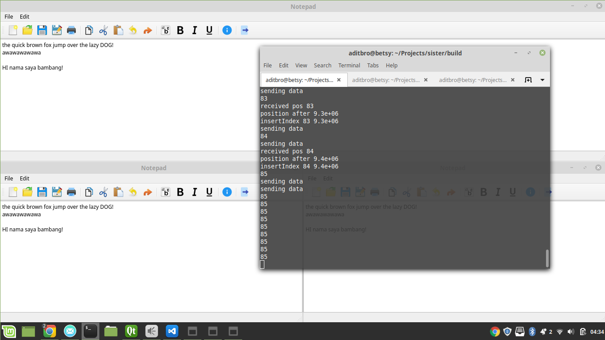
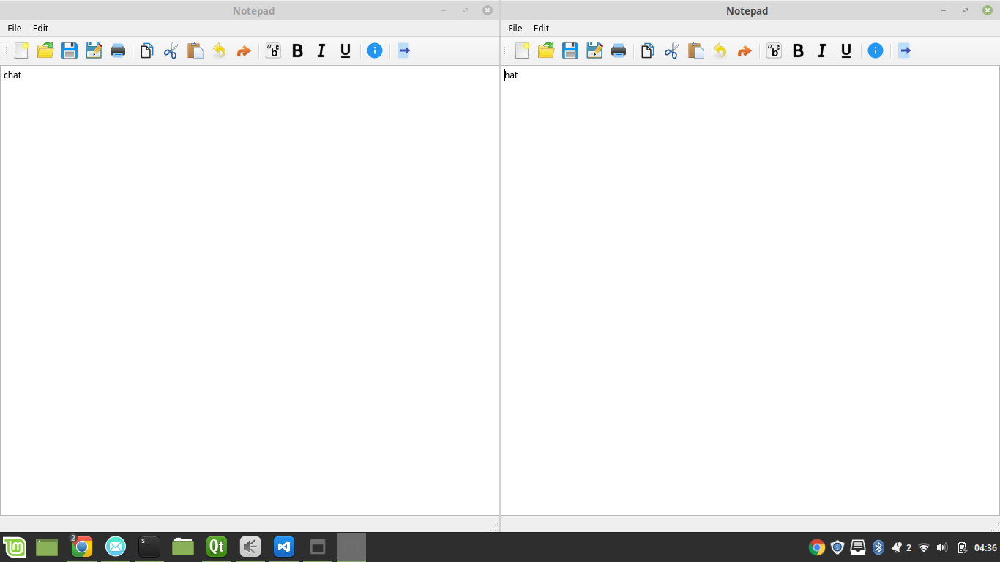

# Peer to Peer Collaborative Editing
#### A cool way to say "Google Docs"

### Petunjuk Penggunaan
1. Install [Qt](qt.io/download) sesuai OS anda (pastikan compiler memiliki unistd.h)
2. Clone repo ini
3. Buka folder build
4. Jalankan perintah `make`
5. Jalankan program dengan command berikut:
```
    ./notepad iplocal:portlocal ippeer:portpeer ippeer:portpeer
```
Misal:
```
    ./notepad 127.0.0.1:2000 192.168.0.1:3000 192.168.0.2:3000
```

### Pembagian Tugas
- 13516043 (22.5%): UI dan CRDT.
- 13516082 (50%): fungsi Controller, Messenger, VersionVector, Deletion Buffer.
- 13516145 (27.5%): [README.md]() (laporan)


### Penjelasan Program

#### Notepad (UI)
Program kami menggunakan Qt sebagai library pembantu membuat user interface - yaitu kelas notepad. Kelas ini berguna untuk menampilkan data dan menangkap input dari user yaitu berupa key press. Kelas notepad terhubung dengan kelas controller melalui mekanisme signal dan slot dari Qt. Notepad memiliki 1 thread khusus yang berjalan untuk memperbarui GUI.

#### Controller
Kelas ini berfungsi sebagai pengatur jalannya program secara keseluruhan. Terdapat 1 buah thread yang berjalan di kelas controller yang berguna untuk memeriksa apakah ada masukan perintah dari kelas lain. Kelas controller berhubungan dengan kelas messenger melalui mekanisme queue, yaitu apabila jika ada pesan baru dari kelas messenger maka messenger akan meletakan pesan tersebut ke dalam sebuah antrian (`MessageQueue`) yang dapat diakses oleh controller. Kelas controller berhubungan dengan kelas notepad melalui mekanisme signal dan slot dari Qt. Kelas controller-lah yang juga memiliki fitur Deletion Buffer dan Version Vector.

#### CRDT
CRDT diimplementasikan menggunakan struktur data vector dari c++. Position pada CRDT disimpan dalam bentuk double, hal ini dilakukan untuk memudahkan pengiriman data CRDT melalui socket (karena tidak ada pointer pada CRDT). Kelas ini digunakan untuk merepresentasikan sebuah data beserta perintah yang datang bersama data tersebut. Berikut ini adalah struktur kelas CRDT kami : 

```
class CRDT 
    int siteId;
    int counter;
    char command;
    char value;
    double position;
```

Agar mudah, implementasi fungsi CRDT (bukan tipe data/class CRDT) terdapat pada kelas controller.

#### Messenger
Program kami berkomunikasi satu sama lain menggunakan koneksi UDP. Namun, program yang berjalan tidak bisa menjangkau peer yang berada di network dengan NAT. Kelas messenger memiliki 2 buah thread, thread untuk mendengarkan pesan masuk dan thread untuk mengirim pesan. Kelas ini berhubungan dengan controller melalui queue. Ketika ada pesan masuk ke dalam thread ini, messenger akan memasukan pesan ke InboxQueue. Jika messenger ingin mengirim pesan maka messenger harus memasukan data ke OutboxQueue.

#### Version Vector dan Deletion Buffer
Version vector disimpan dengan struktur data map, yang menghubungkan siteId sebagai key dan counter sebagai value. Deletion buffer disimpan dalam bentuk queue. Kedua struktur ini berguna untuk menangani kasus terjadinya penghapusan dengan delay. Program akan memasukan seluruh aksi delete ke deletion buffer. Jika counter dari siteId pada action delete sudah sama dengan atau lebih dari counter pada version vector, dan data belum ditemukan, maka command delete tersebut dianggap invalid (kasus idempoten). Jika counter pada action masih lebih dari version vector, maka program menunggu version hingga cocok.


### Analisis
#### Apakah bisa dibuat lebih baik?
Program yang kami buat secara general sudah cukup solid, tetapi ada satu hal yang kami tidak handle: yaitu ketika adanya packet loss. Kami tidak mengimplementasikan protocol untuk mengatasi apabila terjadinya kehilangan packet, dan memastikan bahwa packet yang hilang tersebut bisa terkirim lagi. Apabila sebuah packet hilang, maka command tidak dianggap masuk. Untuk membuat program ini menjadi lebih bisa diandalkan, kami bisa mengimplementasikan protocol untuk mengatasi packet loss yang mungkin terjadi pada UDP.


### Kasus Uji
Untuk mensimulasikan delay, kami membuat agar fungsi sendData memiliki delay satu detik sebelum data benar-benar dikirim.

#### Uji Komutatif
Program kami ketika melakukan dua command dengan urutan yang berbeda, dapat terjamin memiliki hasil yang sama. Hal ini karena CRDT memastikan operasi-operasi (khususnya delete) menunjuk ke suatu karakter yang merupakan karakter yang dimaksud. Hal ini dapat diuji dengan kasus CAT CHAT HAT yang berada pada spesifikasi.

#### Uji Idempotensi
Apabila terjadinya penghapusan karakter yang sama di kedua tempat, maka hanya satu karakter yang sama itu yang dihapus. Alasannya sama, yaitu CRDT memastikan operasi menunjuk ke karakter yang dimaksud. Hal ini dapat diuji dengan kasus HAT yang berada pada spesifikasi.

#### Uji Kausalitas
Uji ini merupakan uji untuk apabila terjadinya suatu latency pada operasi, yang membuat delete terjadi terlebih dahulu sebelum insert, padahal seharusnya insert terjadi terlebih dahulu sebelum delete. Uji ini merupakan uji terhadap kebenaran dari Deletion Buffer yang telah dibuat. 

#### Uji Insert Between
Untuk mengecek kebenaran dari CRDT, pengujian dapat dilakukan dengan cara pertama-tama menginsert dua buah karakter yang berbeda, misal a dan b, kemudian di antara a dan b kita memasukkan data sebanyak mungkin. Misal: 
```
a
ab
a111111111111111111111111111b
```

## Screenshot!
### Tampilan 


### Tampilan, dengan command prompt (proses operasi)


### Pengujian, simulasi delay
