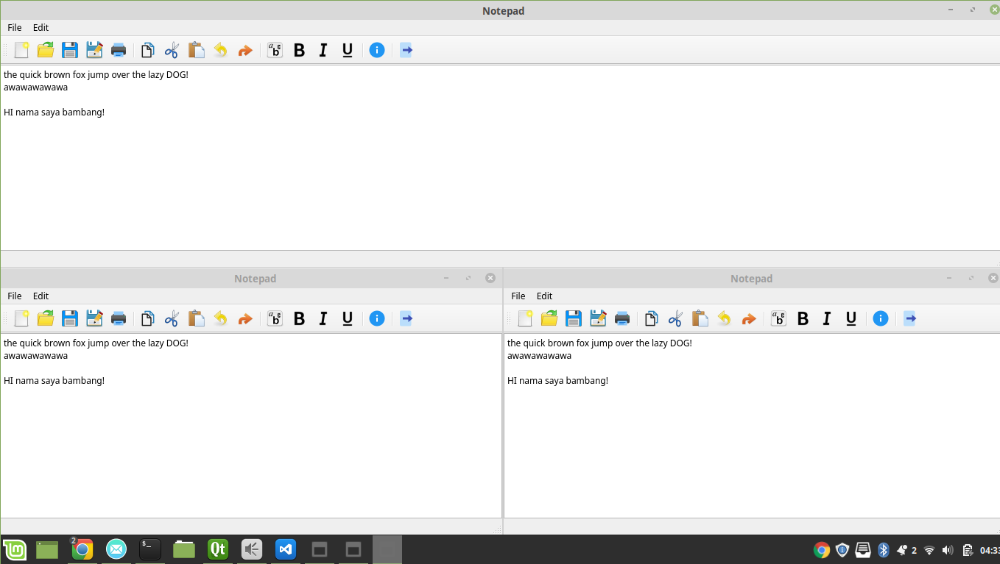

# CoEdit
<p align="center"><b><i>"A cool way to say 'Google Docs'"</i></b><br><br><a href="https://opensource.org/licenses/MIT"></a>
</p>
CoEdit is a peer-to-peer, real-time collaborative text editor that can handle 3 connected clients at one time, built from scratch in C++ utilizing CRDT technology. This is an open source project initiated by 3 computer science students from ITB.

## Usage
1. Install [Qt](qt.io/download) (make sure your compiler has `unistd.h`)
2. Clone this repo
3. Go to repo directory build folder
4. Run `make` command
5. Run app using the following command:
```
    ./notepad local_ip:local_port peer1_ip:peer1_port peer2_ip:peer2_port
```
For example:
```
    ./notepad 127.0.0.1:2000 192.168.0.1:3000 192.168.0.2:3000
```

## How It Works
CoEdit is a peer-to-peer, real-time collaborative text editor that can handle 3 connected clients at one time. A peer-to-peer network design is chosen as it eliminates the need of one dedicated computer running as a server for the application, hence decreasing the coupling within the system, i.e. the failure of one computer does not affect the network as a whole. Each node in the network acts as a network server and client workstation and data from one node is distributed to any other nodes in the network, hence a distributed database.  

Going with this design and implementing a distributed database comes with a challenge. How do we make sure that each peer has the same, most up to date, and agreed upon database? In other words, how do we ensure the consistency of the database? One solution is to use [Conflict-free Replicated Data Type (CRDT)](https://en.wikipedia.org/wiki/Conflict-free_replicated_data_type), a data type that can be replicated across multiple nodes where the replicas can be updated independently and concurrently without coordination between the replicas. CRDT is chosen as it has commutative property. It also guarantees idempotency and causality because it is mathematically possible to resolve inconsistencies which might occur.

### Graphical User Interface
Qt library is used to build the graphical user interface. The GUI is implemented in the `notepad` component. This `notepad` component shows data and captures user inputs, which are key presses. This component is able to communicate with the `controller` component via the Signal and Slot mechanism that is provided by Qt library. This component has 1 reserved thread running to keep the GUI updated.

### CRDT
The CRDT is implemented with vector data structure in C++. This object represents a data and a command that comes with the data. Here is the structure of CRDT class.
```
class CRDT 
    int siteId;
    int counter;
    char command;
    char value;
    double position;
```
Note that the `position` has `double` data type, this is to make CRDT data transmission through socket easier, as there is no such thing as pointer for CRDT data type.  

Also note that the implementation of functions is within the `controller` component.

#### Controller
The `controller` component's function, as the name suggests, is to control the whole flow of the application. This component has 1 thread that continuously checks interrupts or incoming commands from other components. This component has the ability to communicate with the `messenger` component via queue mechanism, i.e. when there is a new message from `messenger`, it will place the message into a designated queue, `MessageQueue`, which can be accessed by the `controller`.

### Peer-to-peer Connection
#### Messenger
This application utilizes UDP connection to communicate to each other but it can't reach peers that is located within a network with NAT. This component has 2 running threads, one for listening for incoming messages and one for sending messages.

## Future Improvements
Although this application is pretty solid network-wise, we still have at least one thing to address. Remember that we are using UDP connection for this application? Yeah, we didn't handle packet loss events. We have not implemented any protocols to handle packet loss and ensure a packet is resent when one is not received. We could implement some sort of protocol to handle packet loss if we wanted to (which, honestly, is not gonna happen haha) in the future.

## Screenshot


## Authors and Project Information
### Authors
1. [Aditya Farizki](https://github.com/aditbro) (Computer Science Department, Institut Teknologi Bandung)
2. [Daniel Yudianto](https://github.com/daniel-yg) (Computer Science Department, Institut Teknologi Bandung)
3. [Dionesius Agung](https://github.com/dionesiusap) (Computer Science Department, Institut Teknologi Bandung)

### Project Information
This project was first developed as an assignment for IF3230 Parallel and Distributed Systems course, fall semester of 2018. Further development of this project has not been discussed yet, but contribution to this project is open.
